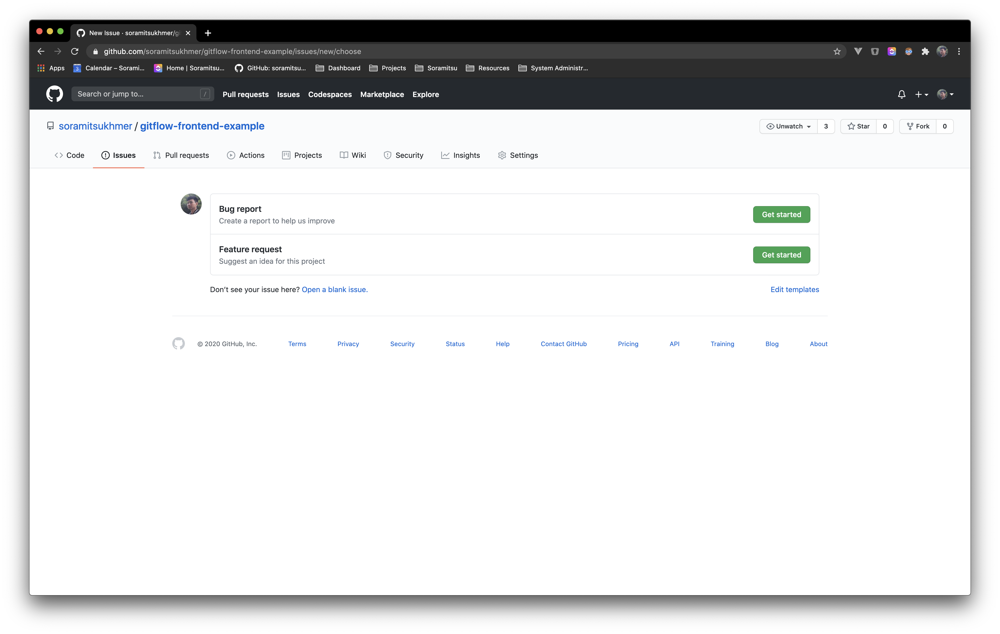

# Issue and Pull reuest Templates

Issue and pull request templates customize and standardize the information you'd like contributors to include when they open issues and pull requests in your repository.

Issue and Pull request templates are defined in a [.github][soramitsukhmer-github] repository.

Which will be available globally to all repo within the @soramitsukhmer organization.

## Issue templates

When you create issue templates for your repository using the issue template builder, they'll be available for contributors to use when they open new issues in the repository.

Using the template builder, you can specify a title and description for each template, add the template content, and either commit the template to the default branch or open a pull request in the repository. The template builder automatically adds the YAML front matter markup that is required for the template to show on the new issue page. For more information, see [.github][soramitsukhmer-github] repository.

## Pull request templates

When you add a pull request template to your repository, project contributors will automatically see the template's contents in the pull request body.

For more information, see [.github][soramitsukhmer-github] repository.

<!-- variables -->
[soramitsukhmer-github]: https://github.com/soramitsukhmer/.github
