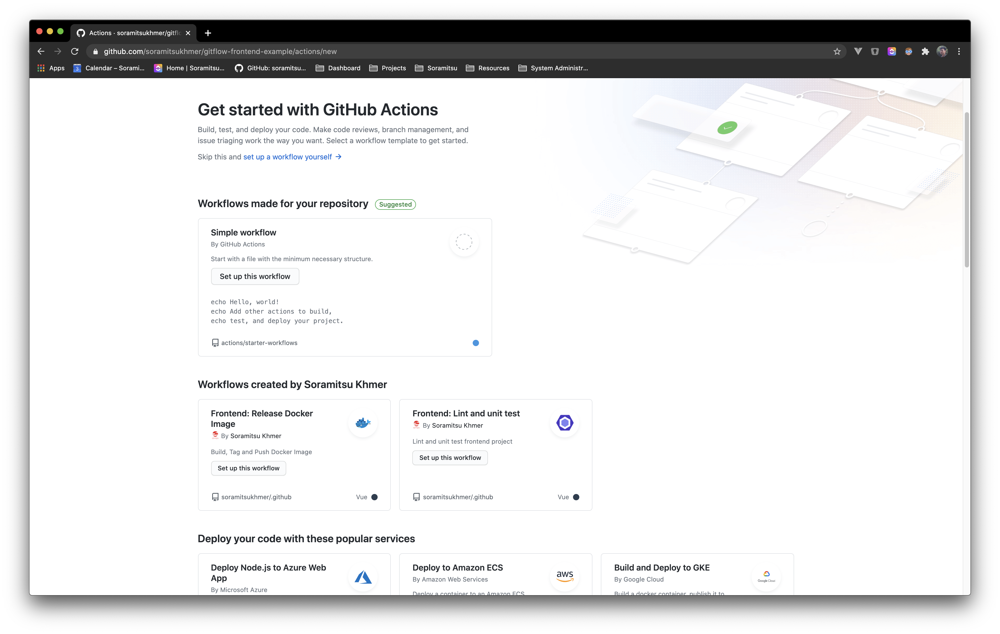

# Workflow Templates

You can now create workflow from [@soramitsukhmer workflow template][soramitsukhmer-github], making it easier to promote best practices and consistency across our organization.

Workflow templates are defined in a [.github][soramitsukhmer-github] repository.

## Using a workflow template

This procedure demonstrates how a member of your organization can find and use a workflow template to create a new workflow. An organization's workflow templates can be used by anyone who is a member of the organization.

1. On GitHub, navigate to the main page of the repository.
1. Under your repository name, click Actions.

    

1. If your repository already has existing workflows: In the upper-left corner, click New workflow.

    

1. Your organization's workflow templates are located in their own section titled "Workflows created by organization name". Under the name of the template you'd like to use, click Set up this workflow.

    

See: https://docs.github.com/en/free-pro-team@latest/actions/learn-github-actions/sharing-workflows-with-your-organization

<!-- variables -->
[soramitsukhmer-github]: https://github.com/soramitsukhmer/.github
